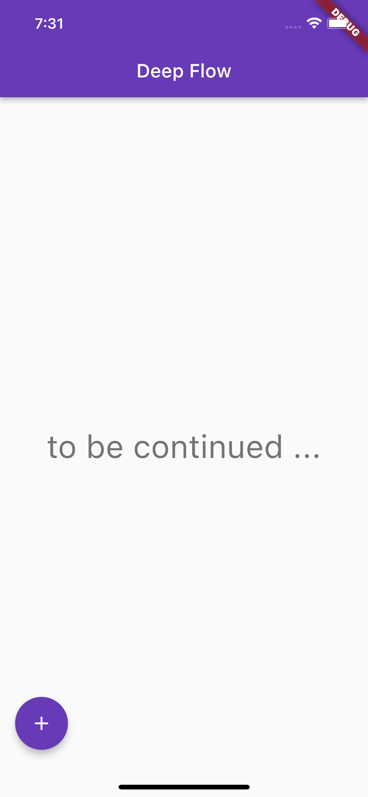

# Flow

A task management, productivity app for the 'unplanned' flow inspired by [#NoEstimates](https://www.google.co.uk/books/edition/NoEstimates/x_QXvgAACAAJ) and [Deep Work](https://www.google.co.uk/books/edition/Deep_Work/lZpFCgAAQBAJ) ideas.

>It is one of several projects which could solve real problems and get used by real users, but their real objective is to help me learn [dart](https://dart.dev) and [flutter](https://flutter.dev). The other projects are: [pataiu](https://github.com/michalporeba/pataiu), [stuffed](https://github.com/michalporeba/stuffed) and [ticks](https://github.com/michalporeba/stuffed). 

&nbsp;
## Problem domain
Yes, it is going to be a yet another *todo* app. It probably will have fewer features than many similar apps out there. It will be intentionally less versatile than most. It will implement a specific workflow that I have been using for some time now as my own [productivity hack](https://www.wanderlustworker.com/productivity-hacks-8-methods-for-being-highly-productive/), and as means of working with teams in corporate environments.

I am aiming to implement the single user experience first, and perhaps later add the collaboration aspect of the flow.  

&nbsp;
## Technical challenges 
* Streams of data and multidevice synchronisation and collaboration (for the multi user mode)
* Complex, multi page navigation to drive the flow

&nbsp;
## The result
So far it looks as unimpressive as this:

